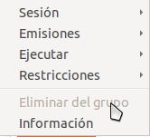
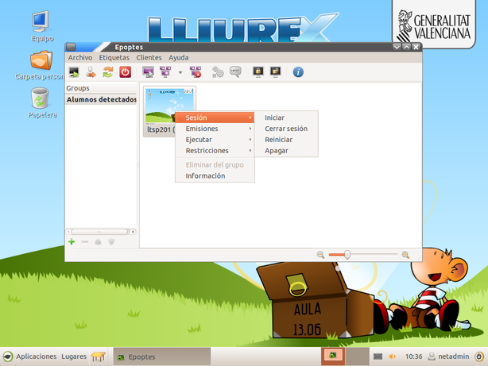
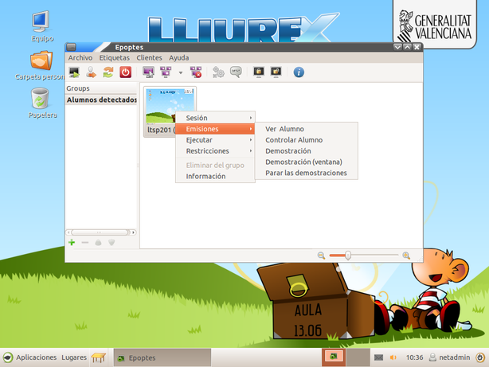
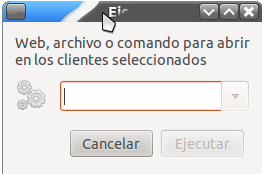
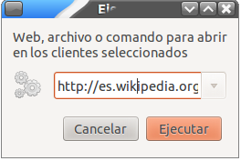
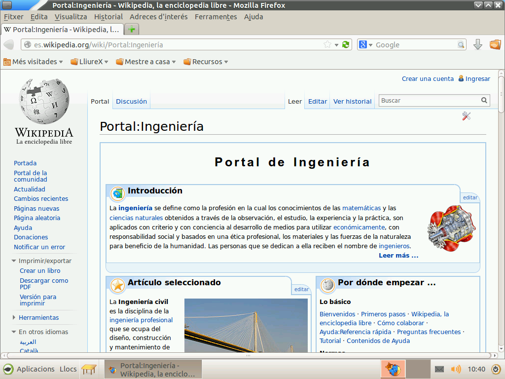
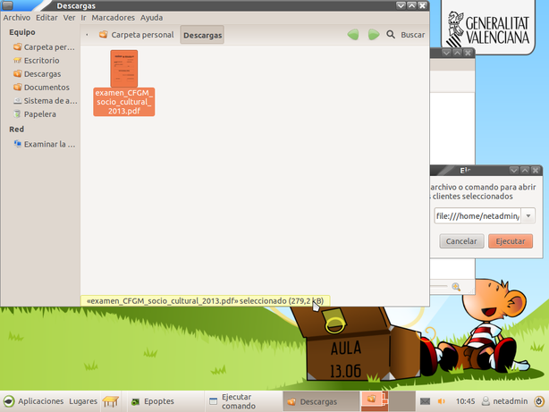
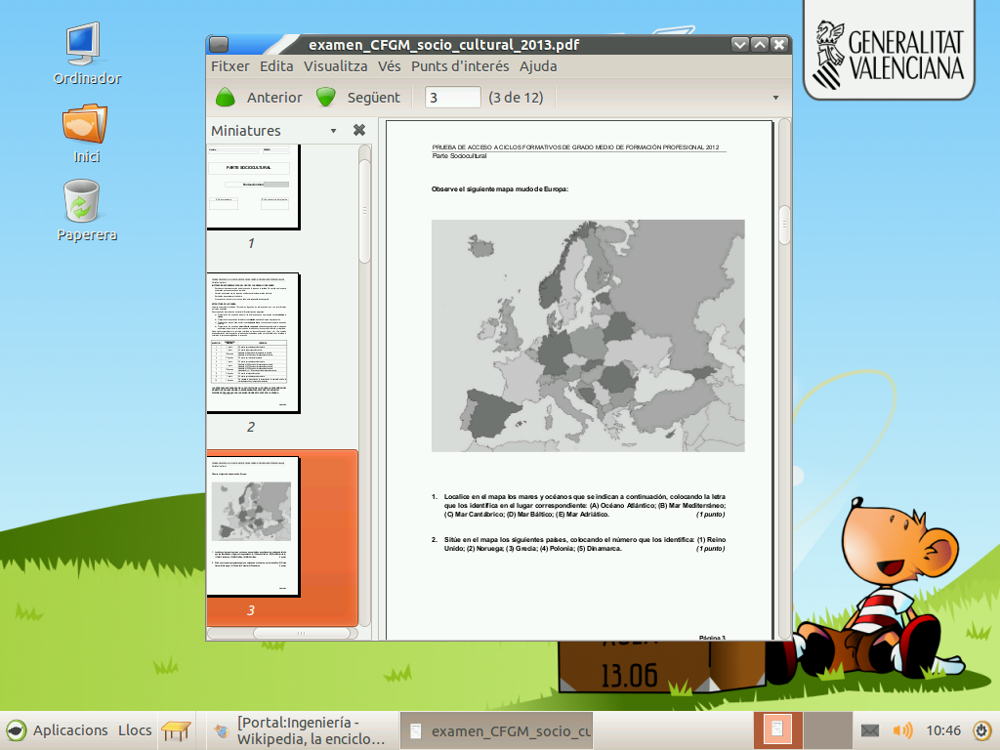
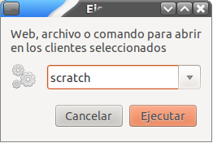

# Epoptes

## ¿Qué es Epoptes?

Introducir las tecnologías de la comunicación en el ámbito educativo conlleva una serie cambios en las estrategias utilizadas por los docentes para impartir sus clases. Se dispone de herramientas hardware y software, así como de grandes repositorios de contenidos digitales sobre cualquier área y materia, que facilitan su tarea docente. Sin embargo esta misma tecnología, a disposición tanto del profesor como del alumno, en el aula puede generar problemas de otra naturaleza.

Es el caso de los alumnos que, al disponer de un ordenador a su servicio, en lugar de atender a las explicaciones del profesor se conectan a Internet, chatean con sus compañeros o simplemente dispersan su atención. En estos casos el ordenador, en lugar de ser una herramienta para mejorar su proceso de aprendizaje, pasa a ser un medio de mero entretenimiento. En _LliureX_ se puede encontrar la aplicación _Epoptes_. Que trata de facilitar la tarea del profesor en el aula y permite una serie de acciones sobre los equipos del aula, como pueden ser:

Mediante esta herramienta el docente puede:

* Ver lo que están haciendo los alumnos.
* Controlar sus ordenadores.
* Enviar mensajes.
* Enviar archivos.
* Ejecutar aplicaciones remotas
* Bloquear la pantalla
* Apagar o reinciar los ordenadores
* ...

Todas estas acciones pueden actuar sobre un sólo equipo, varios seleccionados o todos los equipos del aula.

## ¿Dónde está?

_Epoptes_ se encuentra en el menú: 

-Aplicaciones-->Administración LliureX-->Epoptes

## Uso de Epoptes

Cuando se lanza el _Epoptes_ desde el servidor de aula (o desde un cliente ligero) con un usuario profesor, lo que se muestra es una pantalla de autenticación para comprobar que el usuario que está lanzando el _Epoptes_ tiene permisos para poder controlar a los otros usuarios del aula. Bastará con que se introduzca el usuario y la contraseña del usuario y si son correctos _Epotes_ se lanzará.

A continuación se muestra una ventana donde se pueden ver todos los equipos que hay en ese momento en el aula encendidos y que _Epoptes_ puede manejar. 

> Nota:
> 
> Es importante recordar que el proceso mediante el que servidor de _Epoptes_ se comunica con los clientes requiere que esté encendido el servidor antes de que los clientes del aula vayan arrancando.
> Si un cliente de aula se inicia antes de que el servidor del aula haya arrancado del todo, puede que _Epoptes_ no lo detecte (y que también fallen otros servicios del aula). Bastará con reiniciar ese equipo para que todo vuelva a funcionar correctamente.

Si un cliente todavía no ha iniciado sesión, es decir, el alumno no ha introducido su usuario y su contraseña todavía _Epoptes_ no puede mostrar el escritorio de ese usuario y lo que se vé es un pequeño ordenador que muestra en su pantalla el tipo de cliente (*ligero* o *pesado*) que arrancará cuando el alumno introduzca su usuario y contraseña.

Pasará a mostrar el escritorio del alumno en miniatura, así como cambiará el mensaje que se muestra debajo de la captura, indicando de esta forma cual es el alumno que ha iniciado sesión en ese equipo.

Una vez el usuario ha iniciado la sesión _Epoptes_ permite una serie de acciones que se pueden ejecutar en el equipo. Las acciones aparecen en la barra de botones de _Epoptes_ y cuando pulsamos el botón sobre uno o varios equipos seleccionados. 

> Nota:
> 
> Algunas de las acciones de control de aula pueden ejecutarse desde _Epoptes_ aunque nadie haya iniciado sesión en los clientes, tales como : *Apagar*, *Reinciar*,...

## Acciones

Las distintas acciones que se realizan sobre los alumnos están agrupadas en las siguientes categorías:

* Sesión
* Emisiones
* Ejecutar
* Restricciones

Tal y como se muestra en el menú que aparece sobre los distintos equipos cuando pulsamos sobre ellos con el botón derecho.

A continuación se explican las diferentes acciones.

### Acciónes de Sesión

Desde el menú _Sesión_, _Epoptes_ permite:

* Iniciar el equipo
* Cerrar la sesión 
* Reiniciar el equipos
* Apagarlo

Todas estas acciones tienen que ver con la sesión del usuario o con el propio equipo (_Apagar_ o _Reiniciar_).

### Acciones de Emisiones

Las acciones dentro del menú de _Emisiones_ permiten ver lo que está haciendo el alumnando e interactuar con él, controlando su sesión o mostrando esa sesión al resto del alumnado para que vean como está realizando la tarea que se haya indicado. A continuación se muestra un breve resumen de cada una de las opciones.

* Ver alumno: Muestra lo que está haciendo el usuario, pero sin interactuar con él.
* Controlar alumno: Muestra lo que está haciendo el usuario, pero permite al profesor tomar el control del equipo, así como del ratón y el teclado.
* Demostración: Comienza una demostración que muestra al resto de la clase lo que está haciendo ese equipo, permitiendo así al usuario hacer una demostración de como se hace determinada actividad, una resolución de una práctica, etc.
* Demostración (Ventana): Lo mismo que en el punto anterior pero tan solo de determinada ventana del equipo.
* Parar las demostraciones: Detiene todas las demostraciones activas. 

### Acciones de Ejecutar

En este menú se muestran acciones que interactuan con el alumnado ejecutando o abriendo determinados programas en el equipo. Es en este menú donde el docente encontrará opciones para enviarle al alumnado ficheros, abrirlos, enviar páginas Web, e incluso ejecutar terminales con privilegios en los equipos para tareas de mantenimiento.

Las opciones que se muestran en el primer nivel de menú dentro de _Ejecutar_ son:

* Ejecutar.
* Enviar mensaje. 
* Abrir un terminal.

A continuación se detallan estas acciones de manera individual.

#### Ejecutar 

Cuando pulsamos sobre la opción de ejecutar, lo que se muestra es una ventana como la siguiente:

En este cuadro se indica que si se introduce una página web, lo que se hará en los ordenadores de los clientes es abrirla con el navegador. También permite el envio de ficheros a los alumnos y la ejecución de ordenes en los clientes. A continuación se muestran algunos ejemplos de uso.

##### Ejemplo de uso de página Web

Si se busca una actividad en la que el alumnado ha de buscar cierta información en la _Wikipedia_ y utilizarla a continuación en un ejercicio que se ha elaborado. El docente copia y pega la URL de la Wikipedia donde ha de empezar a buscar el alumnado en el cuadro de Ejecutar.

Cuando se pulsa ejecutar, en los ordenadores clientes se abrirá el navegador predeterminado (en el aula LliureX es el Firefox) y mostrará dicha página.

##### Ejemplo de uso de envio de ficheros

Si en vez de pegar una URL de internet, lo que hacemos es introducir la ruta hasta un documento o archivo de nuestro equipo lo que hará _Epoptes_ es enviar ese archivo a los clientes y lo abrirá. Una manera muy sencilla de utilizar esta herramienta es arrastar y soltar un documento en PDF (por ejemplo un exámen) sobre el cuadro de texto de _Ejecutar_, tal y como se muestra en la imágen:

Y al pulsar ejecutar, los ordenadores clientes recibirán el archivo y lo abrirán.

#### Ejemplo de uso de ejecución de comando

Otra de las opciones que permite este menú es la ejecución remota de aplicaciones. Para ello bastará con se introduzca la orden que se desee ejecutar en el diálogo y se pulse _Ejecutar_.

Y en los clientes se lanzará el Scratch

#### Enviar mensaje

#### Abrir un terminal

