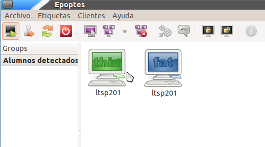
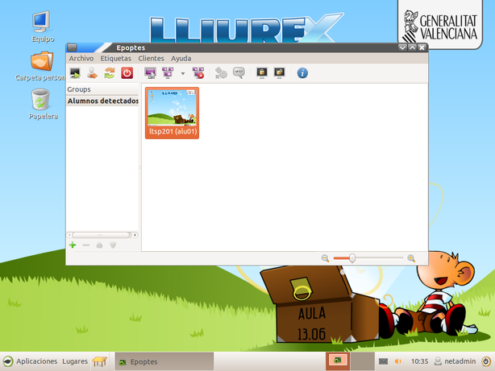

Epoptes
=======

¿Qué es Epoptes?
----------------

Introducir las tecnologías de la comunicación en el ámbito educativo conlleva una serie cambios en las estrategias utilizadas por los docentes para impartir sus clases. Se dispone de herramientas hardware y software, así como de grandes repositorios de contenidos digitales sobre cualquier área y materia, que facilitan su tarea docente. Sin embargo esta misma tecnología, a disposición tanto del profesor como del alumno, en el aula puede generar problemas de otra naturaleza.

Es el caso de los alumnos que, al disponer de un ordenador a su servicio, en lugar de atender a las explicaciones del profesor se conectan a Internet, chatean con sus compañeros o simplemente dispersan su atención. En estos casos el ordenador, en lugar de ser una herramienta para mejorar su proceso de aprendizaje, pasa a ser un medio de mero entretenimiento. En _LliureX_ se puede encontrar la aplicación _Epoptes_. Que trata de facilitar la tarea del profesor en el aula y permite una serie de acciones sobre los equipos del aula, como pueden ser:

Mediante esta herramienta el docente puede:

* Ver lo que están haciendo los alumnos.
* Controlar sus ordenadores.
* Enviar mensajes.
* Enviar archivos.
* Ejecutar aplicaciones remotas
* Bloquear la pantalla
* Apagar o reinciar los ordenadores
* ...

Todas estas acciones pueden actuar sobre un sólo equipo, varios seleccionados o todos los equipos del aula.

¿Dónde está?
------------

_Epoptes_ se encuentra en el menú: 

-Aplicaciones-->Administración LliureX-->Epoptes

Uso de Epoptes
----------------------

Cuando se lanza el _Epoptes_ desde el servidor de aula (o desde un cliente ligero) con un usuario profesor, lo que se muestra es una pantalla de autenticación para comprobar que el usuario que está lanzando el _Epoptes_ tiene permisos para poder controlar a los otros usuarios del aula. Bastará con que se introduzca el usuario y la contraseña del usuario y si son correctos _Epotes_ se lanzará.

A continuación se muestra una ventana donde se pueden ver todos los equipos que hay en ese momento en el aula encendidos y que _Epoptes_ puede manejar. 

> Nota:
> 
> Es importante recordar que el proceso mediante el que servidor de _Epoptes_ se comunica con los clientes requiere que esté encendido el servidor antes de que los clientes del aula vayan arrancando.
> Si un cliente de aula se inicia antes de que el servidor del aula haya arrancado del todo, puede que _Epoptes_ no lo detecte (y que también fallen otros servicios del aula). Bastará con reiniciar ese equipo para que todo vuelva a funcionar correctamente.

Si un cliente todavía no ha iniciado sesión, es decir, el alumno no ha introducido su usuario y su contraseña todavía _Epoptes_ no puede mostrar el escritorio de ese usuario y lo que se vé es un pequeño ordenador que muestra en su pantalla el tipo de cliente (*ligero* o *pesado*) que arrancará cuando el alumno introduzca su usuario y contraseña.

Una vez el usuario ha iniciado la sesión _Epoptes_ permite una serie de acciones que se pueden ejecutar en el equipo. Las acciones aparecen en la barra de botones de _Epoptes_ y cuando pulsamos el botón sobre uno o varios equipos seleccionados. 

<!---->

