PMB
===


Instalación del PMB
-------------------

Para instalar el *PMB*, hay que ir al *Centro de contro de LliureX* en el menú: _Administración de LliureX_

Lo encontramos en la categoría _Software_

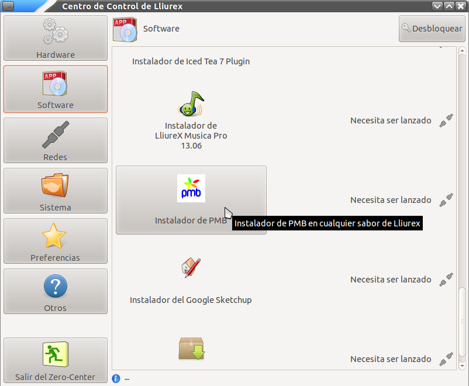

Cuando se hace clic sobre él botón de instalación del *PMB* se muestra un mensaje indicando que el proceso va a tomar cierto tiempo.

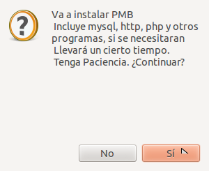

Se muestra un progreso en el que se ven los paquetes que son necesarios para el correcto funcionamiento del PMB.

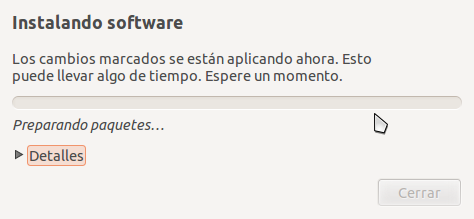

Por último se muestra un aviso de que la instalación ha tenido éxito.

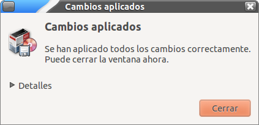

Se puede comprobar que el botón de la instalación ha sido deshabilitado.

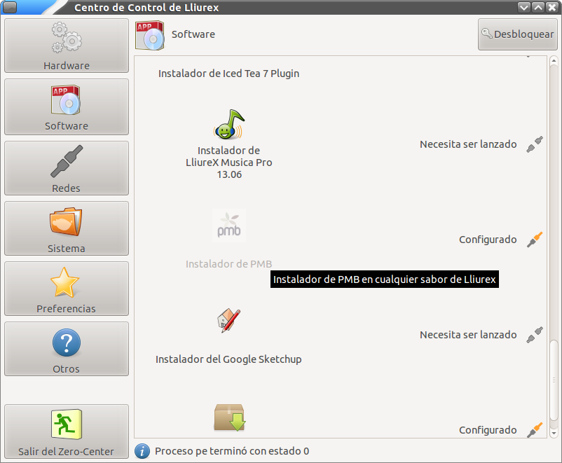


Uso del PMB
-----------

Una vez el PMB está instalado para utilizarlo podemos acceder a él desde : _Aplicaciones->Oficina_

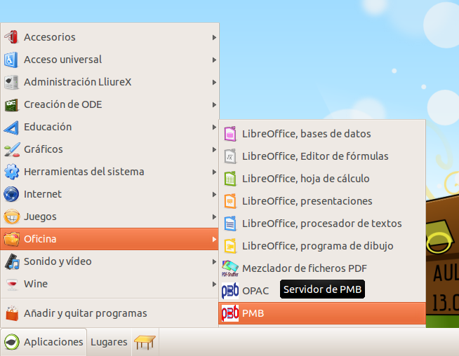

Lo que hace es abrir el navegador indicando la dirección del PMB en nuestro equipo. En el aula _LliureX_ o en la instalación de Bibliotecas la dirección es :

```
http://pmb
```

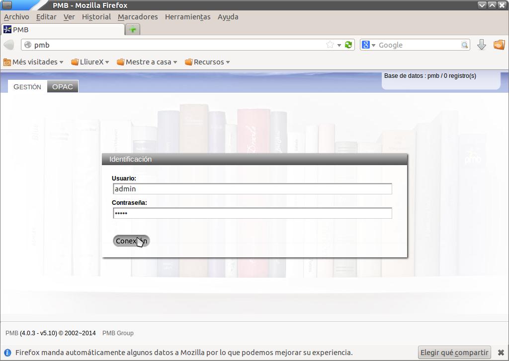
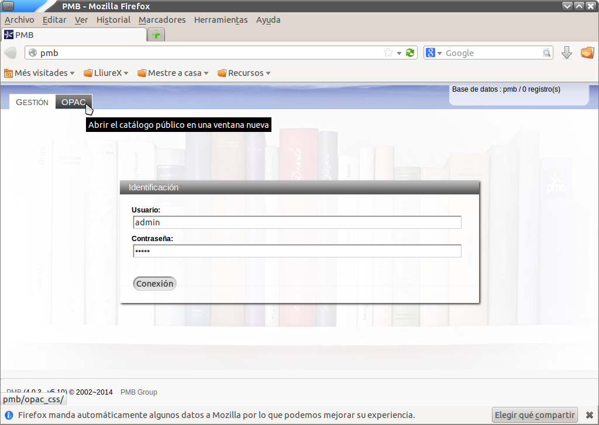
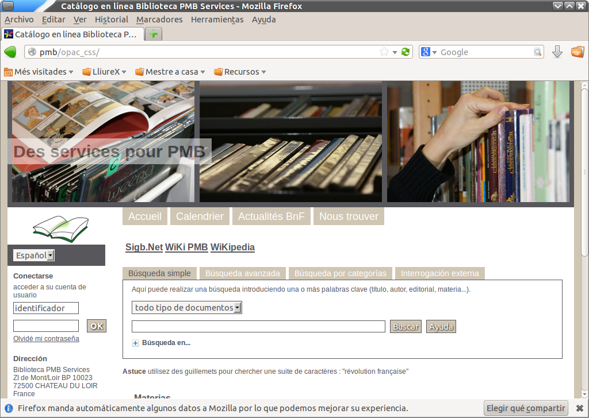
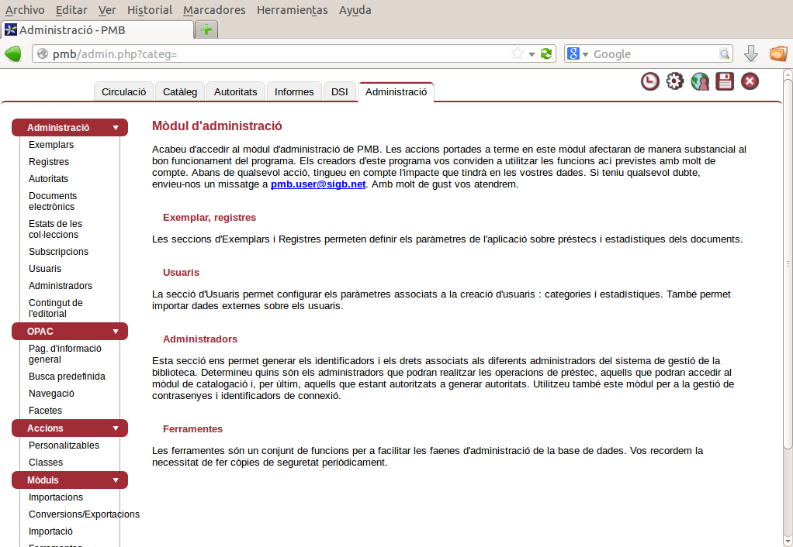
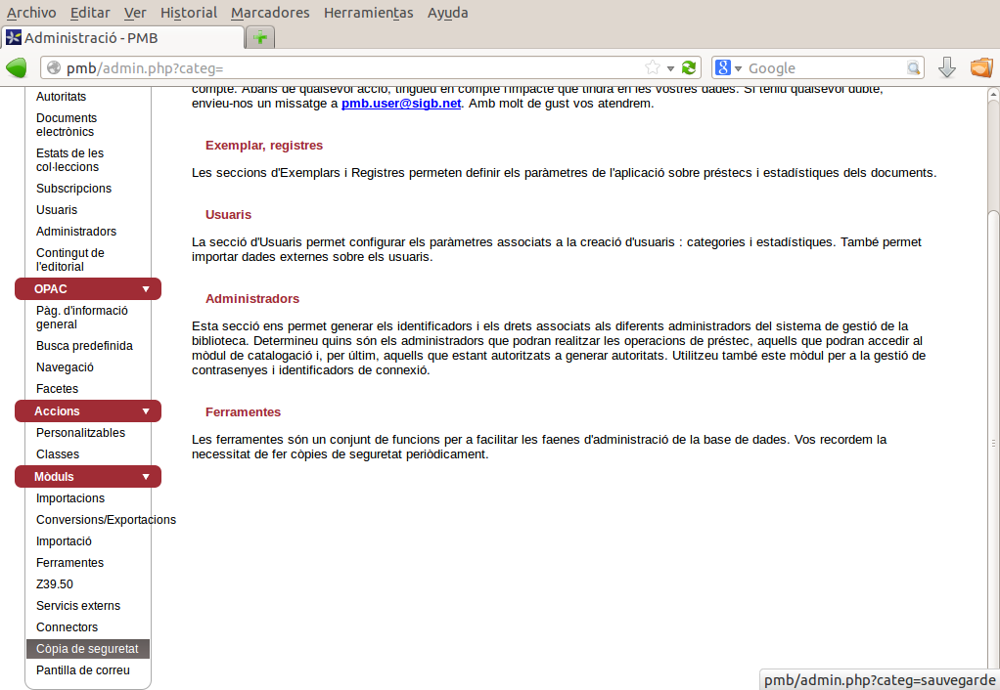
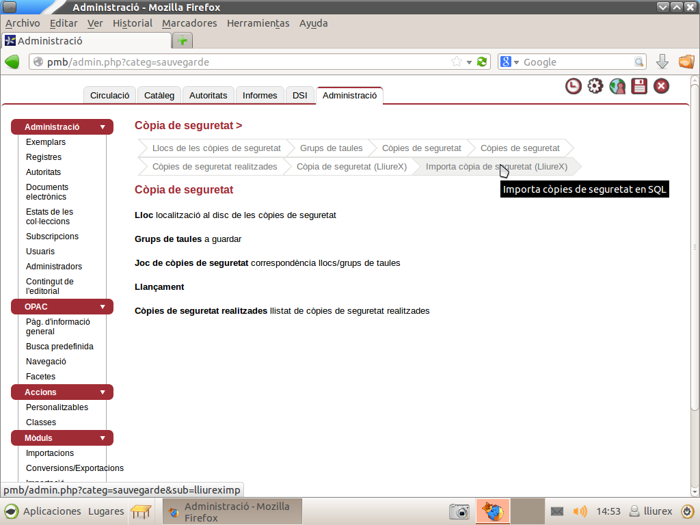
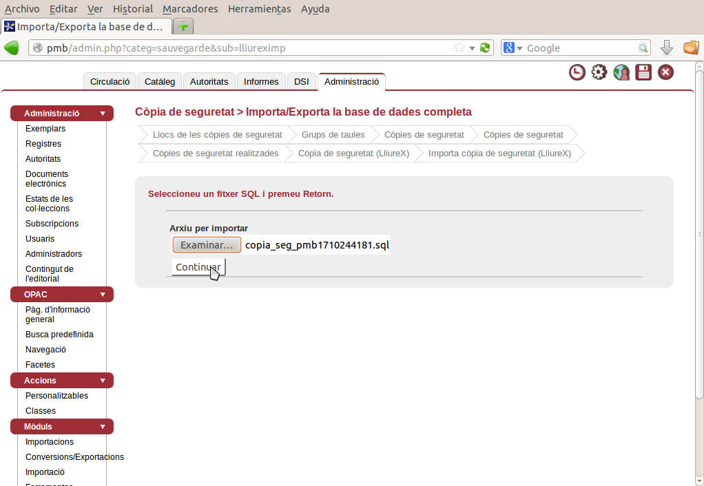
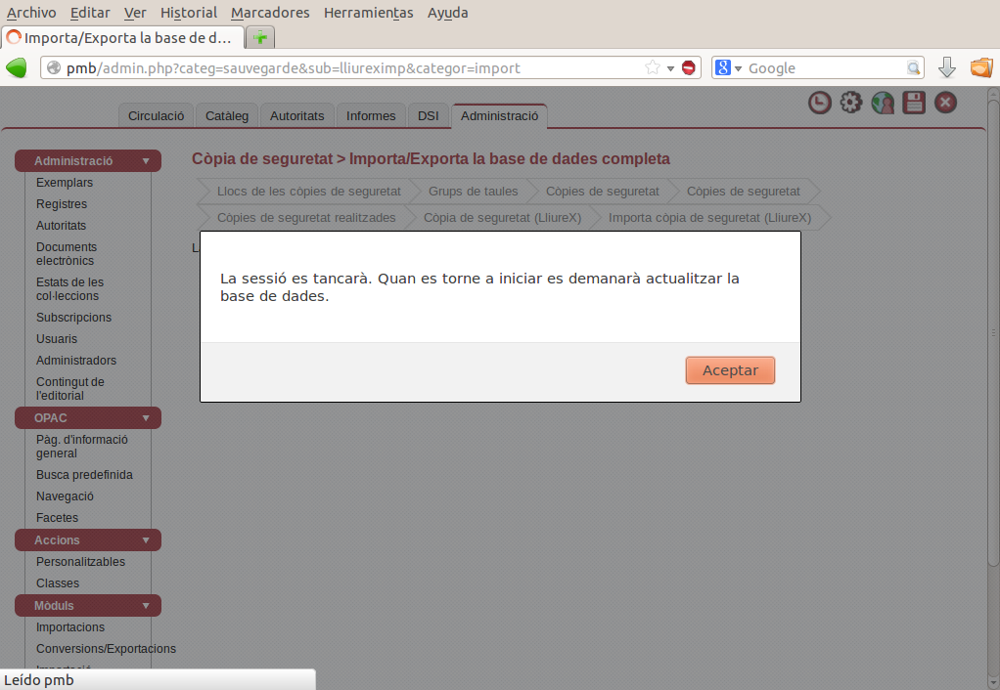
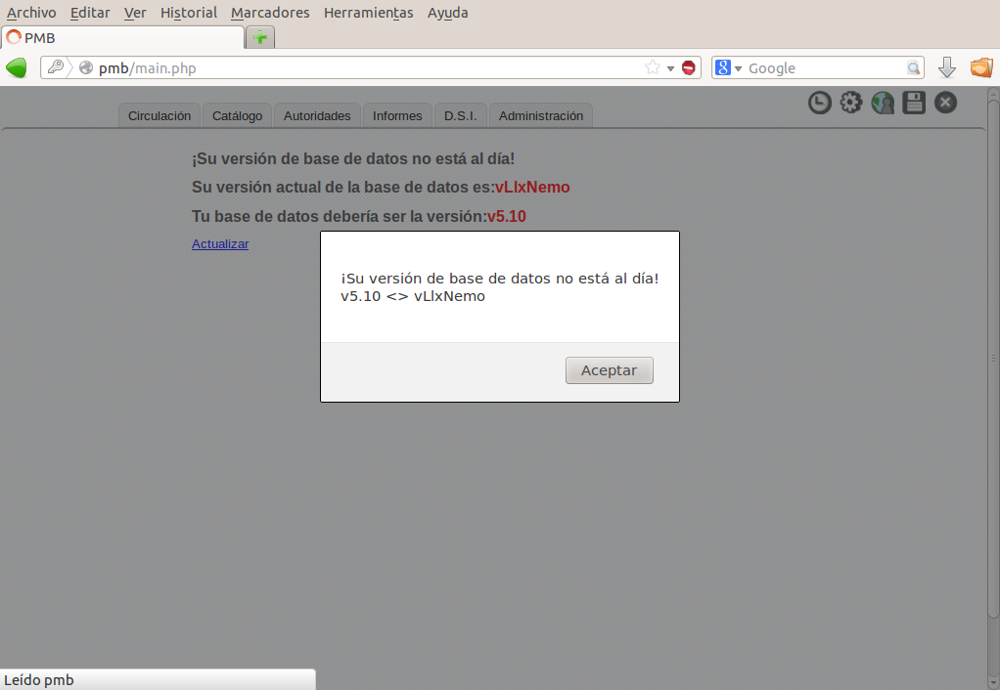
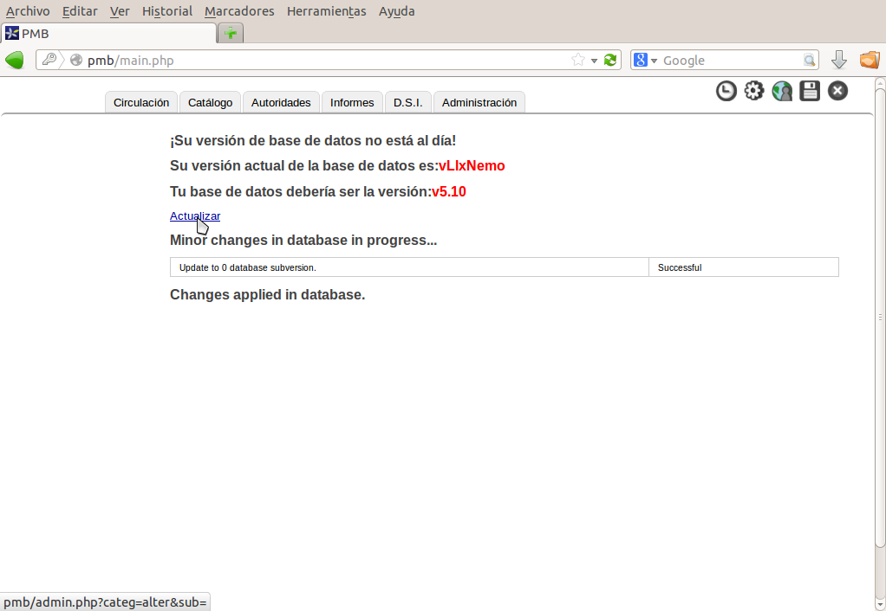
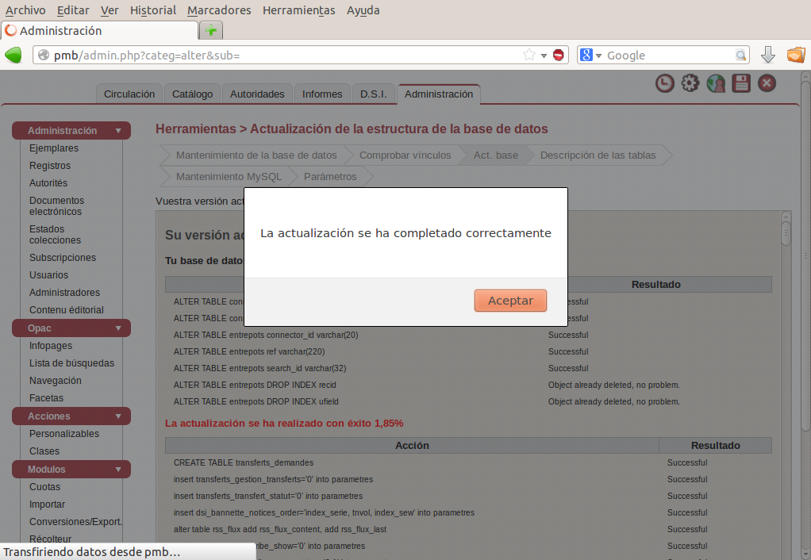
!
2-Confirmar que ses desea instalar, este proceso es prolongado
3-se inicia descarga e instalación
4-Se ha completado la instalación
5-Comprobamos que se ha oscurecido el botón de pmb al completar la instalación.
6a-Se dispone de un icono en para abrir el pmb dentro de aplicaciones oficina.
6b-Tambíen podemos abrirlo directamente en cualquier navegador escribiendo pmb. El usuario y contraseña por defecto es 'admin' (sin comillas)
7-Desde la pantalla principal de pmb podemos acceder también a OPAC, interfaz para los usuarios de la biblioteca.
8-Desde esta pantalla el usuario puede consultar el catálogo de libros, realizar reservas y consultar sus préstamos.
9-> Si ya era usuario de pmb puede restaurar la copia de seguridad en ...
14- Si su copia de seguridad proviene de lliurex 12.09 le indicará que ha de actualizar la base de datos.
15- Pulse sobre el texto actualizar.
16- Se ha completado la actualización ya puede trabajar normalmente.

